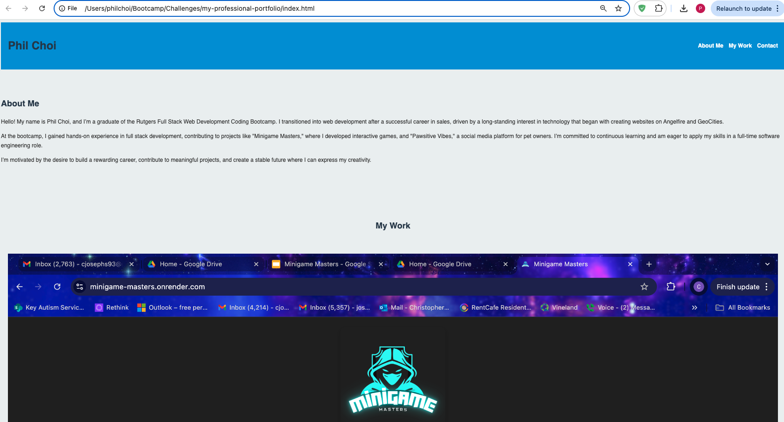

# Professional Portfolio - Phil Choi 

## Description

This is my professional portfolio website, showcasing the projects I have worked on and the skills I have developed as a Full Stack Web Developer. The portfolio is designed to highlight my abilities, provide information about my background, and offer potential employers a way to get in touch with me.

## Screenshot

  

## Features

- **Responsive Design** The portfolio is fully responsive and works on various devices and screen sizes
- **Navigation** Users can easily navigate through the different sections of the portfolio using the navigation bar.
- **Project Showcase:** The "My Work" section displays a selection of my projects with links to the deployed applications.  
- **Contact Information:** Includes my email addres and phone number for potential employers to contact me.

## Technologies Used

- HTML
- CSS
- JavaScript

## Installation

To view the project locally, follow these steps:

1. Clone the repository:
   ```bash
   git clone https://github.com/pchoi87/my-professional-portfolio.git
   ```
2. Navigate to the project directory:
   ```bash
   cd my-professional-portfolio
   ```
3. Open the `index.html` file in your preferred browser.

## License

This project is licensed under the MIT License.

## Acknowledgments

- Special thanks to the Rutgers Coding Bootcamp for providing the knowledge and tools necessary to build this portfolio.